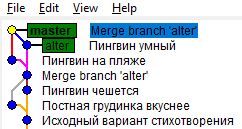

# Про staging area (index)
Гит создаёт коммит из тех файлов, которые добавлены в "индекс" - особое хранилище
подготовленных изменений.

При выполнении
```
git commit -m "Message"
```
создаётся коммит из подготовленных изменений с сообщением `Message`

# Про git status
Команда `git status` показывает неподготовленные правки красным, а подготовленные - зелёным.

# Про git diff
Команда `git diff` показывает отличия между рабочим каталогом/индексом/коммитом

## Дельта между рабочим каталогом и индексом
```
git diff
```
Покажет разницу между рабочим каталогом и индексом

## Дельта между индексом и коммитом
```
git diff --cached
git diff --staged
```
Это синонимы. Они показывают разницу между индексом и последним коммитом

## Дельта между рабочим каталогом и последним коммитом
```
git diff HEAD
git diff @
```
В Git `HEAD` - символическое имя последнего коммита текущей ветки. Коммит,
помеченный как `HEAD`, становится родительским коммитом нового коммита.

Знак `@` является сокращением для `HEAD`

## Дельта между двумя коммитами
```
git diff ref1 ref2
```
Здесь `ref1` и `ref2` - это хеши коммитов, ветки или метки (tags), ссылающиеся
на коммиты
## Дельта между рабочим каталогом и каким-то коммитом
```
git diff ref
```

# Ветвление и слияние в Git
Ветка (branch) в Git — это всего лишь указатель на некоторый коммит. Ветвей
в репозитории может быть несколько и одна из них является текущей. Это значит,
что если создать коммит, то последний коммит текущей ветки станет для нового
коммита родительским, а сама текущая ветка сдвинется вперёд на один шаг.

> Примечание. Иногда можно попасть в состояние, когда ни одна ветвь не является
> текущей — это так называемый detached head. В этом случае текущий коммит
> (на него указывает `HEAD`) есть, но ветка никакая не выбрана. В таком состоянии
> можно создавать новые коммиты, они создаваться будут, но есть риск случайно
> потерять всю работу. Если случайно попадёшь в состояние detached head (строчка
> `detached head` будет сообщаться по `git status`, нужно выполнить команду
> `git checkout -b new_branch`.

В только что созданном новом репозитории есть только одна ветка — `master`,
и она является текущей. Чтобы создать новую ветку, нужно ввести одну из двух
команд:
```
git branch new_branch [ссылка-на-коммит]
```
или
```
git checkout -b new_branch [ссылка-на-коммит]
```
Первая команда просто создаёт новую ветку, которая будет указывать на заданный
коммит, вторая — создаст новую ветку и на неё переключится. Если ссылку
на коммит не указывать, то новая ветка будет указывать на `HEAD` — текущий
коммит.

Для переключения между ветками используется команда
```
git checkout имя-ветки
```
Команда `git checkout` может зафейлиться, если в рабочем каталоге есть
незакоммиченные изменения. В этом случае нужно либо создать коммит
в текущую ветку (а потом переключиться), или освоить припрятывание
(`git stash`). Но о припрятывании позже, сейчас надо освоить основы.

## Упражнение
Давайте создадим файл `penguin.txt` с таким содержимым:
```
Глупый пингвин
робко прячет
тело жирное
в утёсах
```
И зафиксируем его:
```
C:\testrepo> git add penguin.txt
C:\testrepo> git commit -m "Исходный вариант стихотворения"
[master 2d01156] Исходный вариант стихотворения
 1 file changed, 4 insertions(+)
 create mode 100644 penguin.txt
```

Теперь создадим новую ветку и переключимся на неё
```
C:\testrepo> git branch alter
C:\testrepo> git checkout alter
Switched to branch 'alter'
```
Можно было воспользоваться сокращением `git checkout -b alter`, но я
для наглядности предлагаю сделать всё явно.

Теперь изменим стихотворение, вот так:
```
Глупый пингвин
нагло чешет
тело жирное
в утёсах
```
и зафиксируем его
```
C:\testrepo>git add -p
diff --git a/penguin.txt b/penguin.txt
index dd69861..a29aff7 100644
--- a/penguin.txt
+++ b/penguin.txt
@@ -1,4 +1,4 @@
 Глупый пингвин
-робко прячет
+нагло чешет
 тело жирное
 в утёсах
Stage this hunk [y,n,q,a,d,/,e,?]? y
C:\testrepo>git commit -m "Пингвин чешется"
[alter 7c20c9b] Пингвин чешется
 1 file changed, 1 insertion(+), 1 deletion(-)
```
Вернёмся на ветку `master`
```
C:\testrepo>git checkout master
Switched to branch 'master'
```
И снова поправим стихотворение
```
Глупый пингвин
робко прячет
постную грудинку
в утёсах
```
Зафиксируем:
```
C:\testrepo>git add -p
diff --git a/penguin.txt b/penguin.txt
index dd69861..5698c95 100644
--- a/penguin.txt
+++ b/penguin.txt
@@ -1,4 +1,4 @@
 Глупый пингвин
 робко прячет
-тело жирное
+постную грудинку
 в утёсах
Stage this hunk [y,n,q,a,d,/,e,?]? y
C:\testrepo>git commit -m "Постная грудинка вкуснее"
[master 971f824] Постная грудинка вкуснее
 1 file changed, 1 insertion(+), 1 deletion(-)
```

Можно в Gitk посмотреть на две независимые ветви.

Теперь попробуем их слить. Менялись разные, но соседние строки, поэтому
вылезают конфликты:
```
C:\testrepo>git merge alter
Auto-merging penguin.txt
CONFLICT (content): Merge conflict in penguin.txt
Automatic merge failed; fix conflicts and then commit the result.
```
Команда `git status` нам сообщает, что коммит не создан:
```
C:\testrepo>git status
On branch master
You have unmerged paths.
  (fix conflicts and run "git commit")
  (use "git merge --abort" to abort the merge)
Unmerged paths:
  (use "git add <file>..." to mark resolution)
        both modified:   penguin.txt
no changes added to commit (use "git add" and/or "git commit -a")
```
Нужно исправить «unmerged paths» и их закоммитить. Разница отображается
так:
```
C:\testrepo>git diff
diff --cc penguin.txt
index 5698c95,a29aff7..0000000
--- a/penguin.txt
+++ b/penguin.txt
@@@ -1,4 -1,4 +1,9 @@@
  Глупый пингвин
++<<<<<<< HEAD
 +робко прячет
 +постную грудинку
++=======
+ нагло чешет
+ тело жирное
++>>>>>>> alter
  в утёсах
```

Файл приобретает следующий вид:
```
Глупый пингвин
<<<<<<< HEAD
робко прячет
постную грудинку
=======
нагло чешет
тело жирное
>>>>>>> alter
в утёсах
```

Маркеры `<<<<<<< HEAD`, `=======`, `>>>>>>> alter` помечают участки текста,
различающиеся в обоих файлах. Текст между `<< HEAD` и `==` соответствует
текущей ветке, между `==` и `>> alter` — вливаемой. На месте этих маркеров
нужно написать правильный текст:
```
Глупый пингвин
нагло чешет
постную грудинку
в утёсах
```
Посмотрим теперь `git diff`:
```
C:\testrepo>git diff
diff --cc penguin.txt
index 5698c95,a29aff7..0000000
--- a/penguin.txt
+++ b/penguin.txt
@@@ -1,4 -1,4 +1,4 @@@
  Глупый пингвин
- робко прячет
+ нагло чешет
 -тело жирное
 +постную грудинку
  в утёсах
```
Показаны строки, которые взяты как из одной ветки, так и из другой.

У нас пока конфликты, коммит-слияние не создан, репозиторий находится
в подвешенном состоянии. Но файл мы поправили, теперь надо сказать Гиту,
что конфликты разрешены:
```
C:\testrepo>git add penguin.txt
C:\testrepo>git commit
[master 7f2ca39] Merge branch 'alter'
```
При запуске `git commit` без параметров откроется текстовый редактор
с сообщением коммита по умолчанию «Merge branch 'alter'». Текстовый
редактор надо просто закрыть.

Всё, мы создали коммит-слияние с двумя родителями.

Можем вернуться на ветку `alter` и влить в неё ветку `master`:
```
C:\testrepo>git checkout alter
Switched to branch 'alter'
C:\testrepo>git merge master
Updating 7c20c9b..7f2ca39
Fast-forward
 penguin.txt | 2 +-
 1 file changed, 1 insertion(+), 1 deletion(-)
```
Что произошло? Ветка `master` указывала на коммит-потомок ветки `alter`.
В таких случаях при слиянии коммит-слияние не создаётся. Вместо этого
ветка, указывающая на предка, перематывается (fast forward) на коммит-потомок.
Теперь обе ветки, `master` и `alter` указывают на один коммит.

А теперь рассмотрим «гладкое» слияние. Поменяем в ветке `alter` в файле слово
«Глупый» на «Умный».
```
C:\testrepo>git add -p
diff --git a/penguin.txt b/penguin.txt
index eec1a5c..bdcb94a 100644
--- a/penguin.txt
+++ b/penguin.txt
@@ -1,4 +1,4 @@
-Глупый пингвин
+Умный пингвин
 нагло чешет
 постную грудинку
 в утёсах
Stage this hunk [y,n,q,a,d,/,e,?]? y
C:\testrepo>git commit -m "Пингвин умный"
[alter 477bf7e] Пингвин умный
 1 file changed, 1 insertion(+), 1 deletion(-)
```

В ветке `master` — «в утёсах» → «на пляже»:
```
C:\testrepo>git checkout master
Switched to branch 'master'
```
Меняем файл и фиксируем:
```
C:\testrepo>git add -p
diff --git a/penguin.txt b/penguin.txt
index eec1a5c..6c411a1 100644
--- a/penguin.txt
+++ b/penguin.txt
@@ -1,4 +1,4 @@
 Глупый пингвин
 нагло чешет
 постную грудинку
-в утёсах
+на пляже
Stage this hunk [y,n,q,a,d,/,e,?]? y
C:\testrepo>git commit -m "Пингвин на пляже"
[master 322db14] Пингвин на пляже
 1 file changed, 1 insertion(+), 1 deletion(-)
```
А теперь сольём:
```
C:\testrepo>git merge alter
Auto-merging penguin.txt
Merge made by the 'recursive' strategy.
 penguin.txt | 2 +-
 1 file changed, 1 insertion(+), 1 deletion(-)
```
Получился такой файл:
```
Умный пингвин
нагло чешет
постную грудинку
на пляже
```

Картинка вышла примерно такая:

